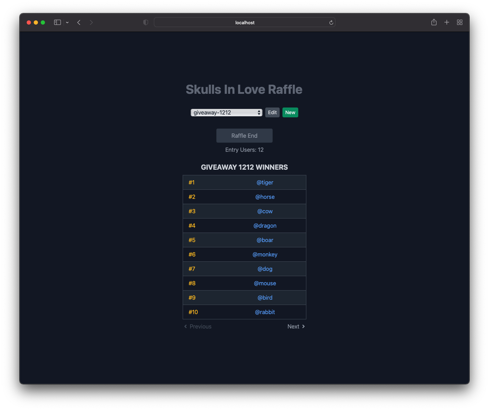

# A simple raffle app built with [Next.js](https://nextjs.org/)

**The Raffle App is a tool for managing giveaway participants and randomly (fairly) picking up winners.**

Raffle screen:



Management screen:


## Running locally

1. Clone this project:

```sh
git clone https://github.com/kjmczk/raffle-app.git
```

2. Change into the directory:

```sh
cd raffle-app
```

3. Install the dependencies:

```sh
npm install
```

4. Run the server:

```sh
npm run dev
```